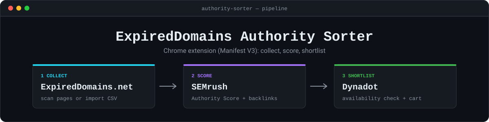
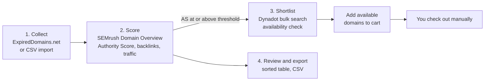

 

A Chrome extension that turns an expired-domain list into a ranked shortlist. It collects domains from [ExpiredDomains.net](https://www.expireddomains.net/), looks each one up on SEMrush's Domain Overview, sorts them by **Authority Score**, and can check availability and fill your cart on Dynadot. **It never buys anything**: the run stops at the cart and checkout stays manual.

## Contents

[Install](#install) · [Usage](#usage) · [How scoring works](#how-scoring-works) · [Safety](#safety-and-limits) · [Project structure](#project-structure) · [Disclaimer](#disclaimer)

## Install

No build step and no dependencies. The folder loads as-is.

1. Open `chrome://extensions`.
2. Turn on **Developer mode** (top right).
3. Click **Load unpacked** and select this folder.
4. After any code change, press the reload icon on the extension's card.

## Usage

### 1. Collect domains

Open any ExpiredDomains.net results page (a keyword search or a per-TLD list). An **Authority Collector** panel appears at the bottom right.

| Action | What it does |
|---|---|
| **Scan This Page** | Stores the ~200 rows currently displayed. |
| **Scan All Pages** | Walks `?start=0,200,400…` until it hits two empty pages in a row, pausing 2.5–4.5 s (randomized) between requests. Click again to stop. |

Domains are deduplicated by name, and re-scanning never erases SEMrush results.

**Already have a list?** Open the runner (extension icon → **Import CSV**) and drop a file on the import panel.

- One domain per row, or a `domain` column anywhere in the file.
- URLs are trimmed to the registrable domain (`https://www.Foo.com/x` becomes `foo.com`).
- Quoted fields, tabs and duplicate rows are handled.
- A CSV exported from this extension imports straight back in.
- Importing **never overwrites** SEMrush or Dynadot results you already have. A row that carries a `semrushAS` value counts as already looked up, so the SEMrush stage skips it.

### 2. Look up Authority Score

Click the extension icon → **Lookup on SEMrush**. This opens a runner tab. Press **Start**: it opens one worker tab and drives it through each domain's Domain Overview page, scraping Authority Score, backlinks, referring domains, organic and paid traffic, and keywords.

- Default delay is 6 s plus jitter between lookups. Raise it if SEMrush starts throttling.
- **Re-check domains already looked up** is off by default, so stopping and restarting resumes instead of redoing work.
- Keep the worker tab visible. If SEMrush shows a login wall or captcha you need to see it, and the runner detects a logged-out state and stops on its own.

### 3. Check availability and cart on Dynadot

**Automatic (default).** Log in to Dynadot first, then start the SEMrush runner with **Auto-cart qualifying domains on Dynadot** ticked. The first domain to reach the threshold opens a Dynadot window, which checks availability and carts matches *while the SEMrush lookup is still running*.

- It stops by itself when SEMrush finishes and the queue is empty.
- It also stops after two batches whose cart click is never confirmed, which is the usual sign of a logged-out session, instead of burning through the whole queue.
- Only one Dynadot tab can drive it at a time. A second tab stands down rather than double-carting.

**Manual.** Log in to Dynadot yourself and open [Bulk Search](https://www.dynadot.com/domain/bulk-search). A **Dynadot Auto-Cart** panel appears at the bottom right. The extension never opens or navigates this tab for you.

| Setting | Default | Meaning |
|---|---|---|
| **Min SEMrush AS** | `7` | Only domains at or above this Authority Score are queued. Domains never looked up on SEMrush are never queued. |
| **Batch size** | `100` | Domains per search. Dynadot's exact search caps at 1000 per query. |
| **Add available to cart** | on | Turn it off to check availability without touching the cart. |

Press **Run availability check**. For each batch it fills the search box, searches, records every result, then ticks only the available domains from that batch and clicks **Add to cart**. The subtotal is logged in the panel before the click.

The panel forces Dynadot's **Exact Search** mode. The default "Filter by TLD" mode multiplies every name against the 10 selected TLDs, so 50 domains would become 500 results and cart names you never asked for.

### 4. Read and export

Click the extension icon for the results table. It is sorted by **SEMrush AS** by default, and any column header re-sorts it. Domains not yet looked up always sort to the bottom instead of counting as zero. **Export CSV** writes every stored field, ordered by SEMrush AS and then local score.

## How scoring works

| Column | Source |
|---|---|
| **SEMrush AS** | The real Authority Score scraped from SEMrush (0–100). Blank means not looked up. `n/a` means SEMrush has no data for that domain. |
| **Local Score** | An offline heuristic computed in `utils.js` from ExpiredDomains' own columns: backlinks, domain pop, Archive.org crawls, Wikipedia links, Majestic Million rank and domain age. A fallback ranking only. |

Neither is Moz DA/PA. SEMrush does not expose Moz metrics, and neither does ExpiredDomains. Authority Score is SEMrush's own equivalent and the closest real authority metric available here. Freshly dropped domains are usually missing from SEMrush's index entirely and will show `n/a`.

## Safety and limits

- **Nothing is purchased.** The run ends at the cart, and checkout is yours.
- **Local only.** Results are stored in your browser (`chrome.storage.local`). There is no backend server and no telemetry: the only request the extension makes itself is a same-origin fetch of the next ExpiredDomains page during **Scan All Pages**.
- **Your sessions.** It works inside pages you are already logged in to. It never reads, stores or exports your passwords or tokens.
- **Throttle-aware.** Randomized pauses, a configurable delay, and automatic stop on a login wall, captcha or unconfirmed cart.
- **Permissions.** `storage` and `tabs`, plus host access to `member.expireddomains.net`, `www.semrush.com` and `dynadot.com`.

## Project structure

| File | Role |
|---|---|
| `manifest.json` | Manifest V3 definition |
| `utils.js` | Shared number parsing and the local score formula |
| `content.js` / `content.css` | ExpiredDomains scraper and floating panel |
| `content-semrush.js` | SEMrush Domain Overview scraper |
| `content-dynadot.js` / `content-dynadot.css` | Dynadot bulk-search availability check and cart panel |
| `runner.html` / `.css` / `.js` | Batch lookup driver |
| `popup.html` / `.css` / `.js` | Sorted results table and CSV export |
| `background.js` | Toolbar badge count |

## Disclaimer

This tool automates pages you can already use in your own logged-in browser. Review the terms of service and rate limits of ExpiredDomains.net, SEMrush and Dynadot before using it, and use it at your own risk. It is an independent project and is not affiliated with or endorsed by any of them.
